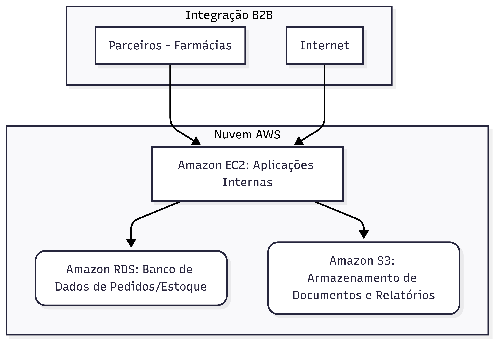

Introdução

Este relatório descreve a migração da infraestrutura da Abstergo Industries, uma distribuidora farmacêutica, para a nuvem da AWS. O principal objetivo foi modernizar nossas operações e reduzir custos, substituindo hardware local por serviços gerenciados. A mudança visa aumentar a eficiência no gerenciamento de estoque, pedidos e na comunicação com nossos parceiros, ao mesmo tempo em que aprimoramos nossa agilidade e confiabilidade.

Resumo do Projeto

O projeto foi dividido em três etapas, focando na implementação de serviços chave da AWS: Amazon S3, para armazenamento de dados; Amazon RDS, para nosso banco de dados central; e Amazon EC2, para rodar nossas aplicações e APIs. Essa abordagem modular nos permitiu otimizar cada componente da nossa infraestrutura.

Etapa 1: Armazenamento Escalável com Amazon S3

Substituímos nossos servidores de arquivos locais pelo Amazon S3. Agora, todos os catálogos de produtos, relatórios e documentos de integração (CSV/JSON) estão armazenados de forma segura e acessível. O S3 nos permite pagar apenas pelo espaço que usamos, eliminando a necessidade de grandes investimentos em armazenamento físico. Isso garante a durabilidade e a disponibilidade dos nossos dados, facilitando a colaboração com nossos parceiros.

Etapa 2: Gerenciamento de Dados com Amazon RDS

O Amazon RDS foi implementado como nosso novo banco de dados relacional. Ele hospeda todas as informações críticas, como pedidos, estoque e dados de clientes. Com o RDS, não nos preocupamos mais com backups, atualizações ou falhas de hardware, pois o serviço gerencia tudo automaticamente. O resultado é um banco de dados confiável e de alto desempenho, que sustenta todas as nossas operações críticas com o mínimo de esforço da nossa equipe de TI.

Etapa 3: Aplicações Flexíveis com Amazon EC2

Nossas aplicações internas de pedidos, APIs e integrações agora rodam em instâncias do Amazon EC2. Essa mudança nos deu a flexibilidade de aumentar ou diminuir a capacidade de processamento conforme a demanda, como em períodos de pico de pedidos. Diferente de servidores físicos, que ficam ociosos e geram custos, o EC2 nos permite otimizar os gastos pagando apenas pela capacidade de computação que realmente utilizamos.

Conclusão
A adoção do Amazon S3, Amazon RDS e Amazon EC2 transformou a Abstergo Industries, substituindo gastos fixos com infraestrutura por um modelo de custos mais flexível e previsível. Além da significativa redução de despesas, nossa operação agora se beneficia de maior escalabilidade, segurança e confiabilidade. Estamos mais bem preparados para crescer e nos adaptar rapidamente às exigências do mercado farmacêutico, mantendo a excelência em nossas operações.

Anexos
Diagrama da Arquitetura de Solução

Assinatura do Responsável pelo Projeto:
Danilo Lima
